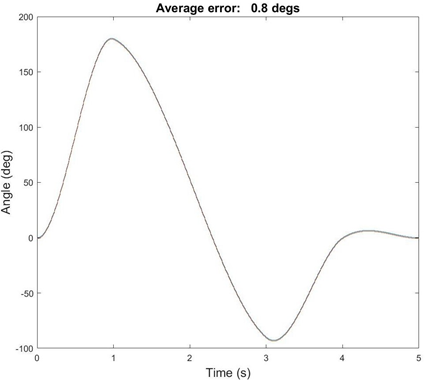

# DC Motor Control

## Summary

This project develops two different pieces of software that communicate with each other - PIC32 code for the motor driver and the client user interface that runs on the host computer.

The PIC32 code (C Language) implements the control strategy (PID controller), consisting of a low-frequency position control loop and a nested high-frequency current control loop. The outer control loop runs at 200 Hz and the inner current control loop runs at 5 kHz. PWM is at 20 kHz.

### Results

**Current Control Error Plot:**

**Step Trajectory Error Plot:**

**Cubic Trajectory Error Plot:**

